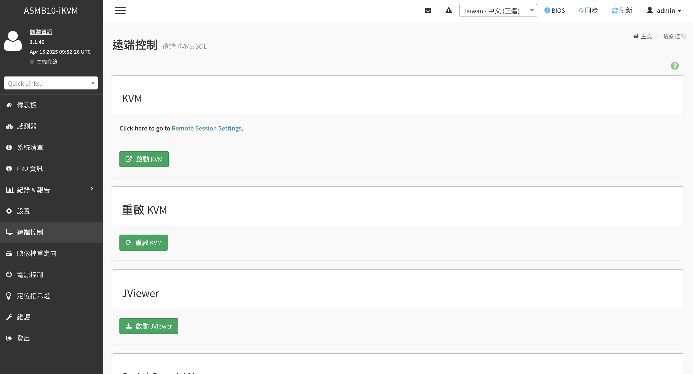
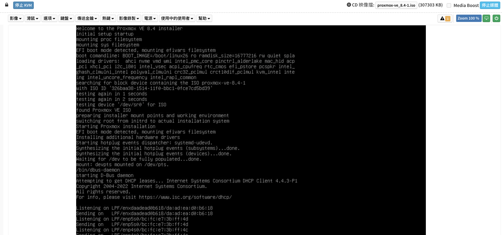
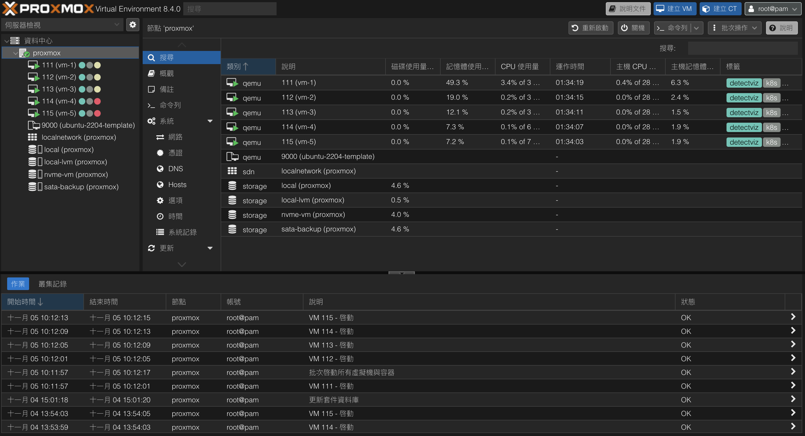
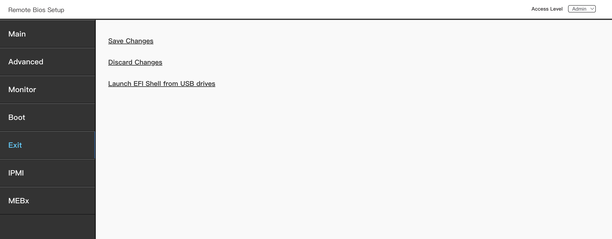

# Proxmox 設置

- [KVM 文件 Repository](https://github.com/detectviz/pro-ws-w680-ace-ipmi)

- [Proxmox 官網 下載 ISO 檔案](https://www.proxmox.com/en/downloads/proxmox-virtual-environment/iso)
 > 8.4-1 版本較穩定，目前最新版本是 9.0-1

- [Proxmox 安裝教學參考文章](https://www.chirue.com/en/proxmox-install/)

## 安裝步驟

### KVM 設置
- KVM 遠端控制選單頁面，點擊「啟動 KVM」


- 從 KVM 遠端上傳 Proxmox ISO 檔案
> 這邊要等一下，上傳完整要等一段時間


- Proxmox UI 點擊右上角 「建立 VM」上傳 VM ISO 檔案


### 安裝 Proxmox VE
- 下載最新版 ISO（proxmox-ve_8.4-1.iso）。
- 安裝時選擇 「自訂 (Advanced) 安裝」。
- 進入 BIOS → Boot 頁面

### BIOS 設置開機順序
```bash
Boot Option #1 → proxmox 指定安裝的磁碟名稱
```
> 請於 BIOS 中移除其他項目，確保系統由指定磁碟啟動。

### 進入主機後註解 Proxmox 企業訂閱源
```bash
root@proxmox:/etc/apt/sources.list.d# cat pve-enterprise.list
#deb https://enterprise.proxmox.com/debian/pve bookworm pve-enterprise
root@proxmox:/etc/apt/sources.list.d# cat ceph.list
#deb https://enterprise.proxmox.com/debian/ceph-quincy bookworm enterprise
```
> 沒有註解的話，更新其他套件時 Proxmox 會自動更新到 enterprise 版本，造成阻擋更新。

### KVM 設置每次開機順序為 Proxmox ISO

- Boot Option Priorities：`proxmox` -> `UEFI OS` -> `UEFI: Proxmox VE ISO`
- Other OS：`OS Type`


- Secure Boot Mode：`Custom`


- 儲存設置
